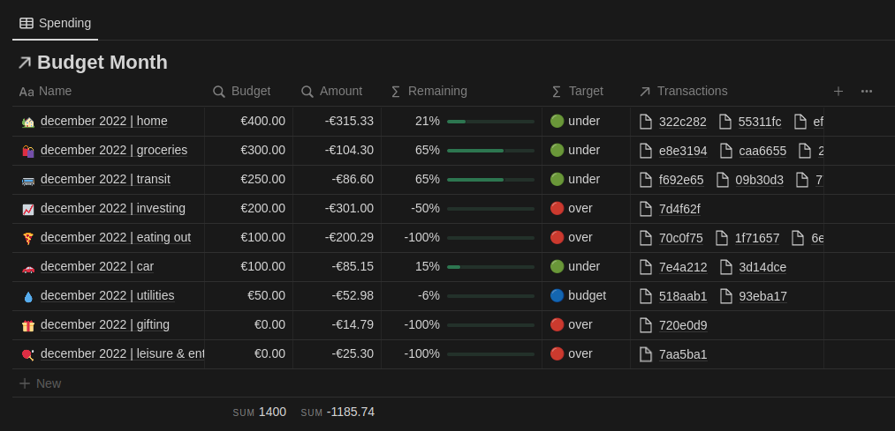

# Cashflow Manager



Manage your funds without input every single transaction manually on
[Notion](https://www.notion.so/).

# Table of Contents

- [Cashflow Manager](#cashflow-manager)
- [Table of Contents](#table-of-contents)
- [Features](#features)
- [Motivation](#motivation)
- [Usage](#usage)
  - [Frontend](#frontend)
  - [Two-stage](#two-stage)
- [Develop](#develop)
  - [Statements](#statements)
    - [`vivid`](#vivid)
    - [`revolut`](#revolut)
    - [`intesa`](#intesa)
  - [Processors](#processors)
- [Credits](#credits)

# Features

* 🏦 Extract transactions from your bank statement
* 📚 Automatically categorize transactions
* 🦄 Associate transactions to a budget item
* ⚡ Multiple statement process and upload
* 🎨 Aggregate and monthly view

# Motivation

Being able to manage, measure and administer funds is essential in everyday
life: every notable expense or investment must be planned according to your
money availability, moreover a good cashflow can help you save money and
rationalize you expenses. ([Cash Flow 101: The Essential of Healthy Finances](https://medium.com/spendee/cash-flow-the-essential-of-healthy-finances-db608aa1faaf), [Do you know your monthly Cash Flow?](https://medium.com/spendee/do-you-know-your-monthly-cash-flow-b48aa27dd790))

However, keeping an accurate and reliable personal cashflow can be a complex and
time-consuming task. 

Thus, people usually ends up using proprietary software with limited
functionalities and premium features ([Money
Patrol](https://www.moneypatrol.com/), [Mint](https://mint.intuit.com/),
[Spendee](https://www.spendee.com/)), or, in the worst case, excel.

Such type of solution usually suffers some problems like

* vendor lock-in, i.e. it's difficult to move from a platform to another due to
  incompatible data format or difficult data export;
* manual data input;
* limited functionalities;
* limited customization (the way one manage finance is extremely personal);
* bloated interfaces; and
* expansive subscriptions

This project aims to partially solve some of this problems by combining
[Notion](https://www.notion.so/) - the most popular no-code platform - with some
bare bone data processing in Python: this combo enables a fully customizable
cashflow, a fulfilling interface, cross-platform access to data and
automatically data processing.

# Usage

## Frontend

You can process and upload statements by using `cashflow.sh`. This is an utility script that given an input file, folder or unix pattern process all statements found guessing the correct provider* and upload transactions to notion.

\* in order to guess the processor, statements file name must end with `*<PROCESSOR>.csv`.


```
Usage: ./cashflow.sh [OPTION]... INPUT
Import transaction in Notion cashflow and budget manager

Starting from bank statements in CSV format this script generates processed
transactions with a category and a budget item. Then, imports data into
cashflow and budget manager in notion.
Currently supported bank statements are: intesa, vivid, revolut.

Options:
  -t, --notion-token   token for notion APIs
      --notion-transactions-database-url
                       url to transactions database
      --notion-budget-month-database-url
                       url to budget month database
  -o, --tmp-dir        directory where processed file are saved
  -f, --force          force notion upload without confirmation prompt
  -d, --debug          show debug information
      --dev            use poetry script instead of system installed cashflow
                       and budget processor
  -h, --help           display this help and exit
```

Example

```
./cashflow.sh --debug statements_202211
```

where `statements_202211` contains bank monthly statements:

* 202211.intesa.csv
* 202211.vivid.csv
* 202211.revolut.csv

## Two-stage

The app works in two stage:

1. Given a bank statement in CSV format, you can process it by running

```
statement_processor --processor <PROCESSOR> <PATH/TO/INPUT.csv> <PATH/TO/OUTPUT.csv>
```

this will produce a CSV file containing all transactions processed for direct upload to notion.

2. Given a processed statement (i.e. transactions file), you can upload it to notion by running

```
csv2notion --token <NOTION-TOKEN> --url <NOTION-TRANSACTIONS-DATABASE-URL> --merge --add-missing-relations <PATH/TO/PROCESSED.csv>
```

# Develop

## Statements

Currently supported statements must be formed as follows (example given).

### `vivid`

```csv
Booking Date,Value Date,Type,Description,Amount,Currency,FX-rate,Included Markup
05.11.2022,04.11.2022,Card purchase,foo bar market,-59.39,EUR,,
08.12.2022,07.12.2022,Card purchase,ciccio's restaurant,-47.58,EUR,,
23.12.2022,22.12.2022,Card purchase,gas station,-50.00,EUR,,
23.12.2022,22.12.2022,SEPA Credit Transfer,payment from Bob,300.00,EUR,,
```

### `revolut`

```csv
Type,Product,Started Date,Completed Date,Description,Amount,Fee,Currency,State,Balance
CARD_PAYMENT,Current,2022-10-11 20:08:34,2022-10-12 16:54:42,Amzn Digital,-7.99,0,EUR,COMPLETED,34.03
CARD_PAYMENT,Current,2022-10-12 17:47:41,2022-10-13 11:20:33,Deliveroo,-19.89,0,EUR,COMPLETED,14.14
TOPUP,Current,2022-10-14 7:33:12,2022-10-14 7:33:12,Payment from Bob,500,0,EUR,COMPLETED,514.14
TRANSFER,Current,2022-10-17 7:08:47,2022-10-17 9:05:35,To Alice,-200,0,EUR,COMPLETED,314.14
```

### `intesa`

```csv
Data,Operazione,Dettagli,Conto o carta,Contabilizzazione,Categoria ,Valuta,Importo
11/29/2022,Bonifico Disposto A Favore Di Bob,XY NOTPROVIDED XY Bonifico Da Voi Disposto A Favore Di Bob Bergamo Versamento AA,Conto XY,CONTABILIZZATO,Bonifici in uscita,EUR,-500.00
11/28/2022,Pam,Pagamento Su POS PAM XY Carta N.XXXX XXXX XXXX XXXX COD. XX/XX,Conto XX/XX,CONTABILIZZATO,Generi alimentari e supermercato,EUR,-2.49
```

## Processors

Processors are the unit of work that know how to process a CSV bank statements
and produce the processed transactions file ready for the upload.

We currently support following processors:

| Status | Processor | Bank |
| --- | --- | --- |
| ✅ | vivid | Vivid |
| ✅ | revolut | Revolut |
| ✅ | intesa | Intesa San Paolo |

You bank is not listed here? Please open an
[issue](https://github.com/lparolari/cashflow/issues) and provide an example of
bank statement.

# Credits

Many tanks to 

* [Red Gregory's Notion Cashflow Template](https://www.redgregory.com/notion/2021/5/17/notion-budget-template-monthly-personal-cash-flow),
* [Roxanne Notion Finance Tracker Template](https://www.notion.so/Finance-Tracker-dc1a54bd191c4b7499713107c89835db)

that inspired this project, and 

* [csv2notion](https://github.com/vzhd1701/csv2notion), for the upload script
